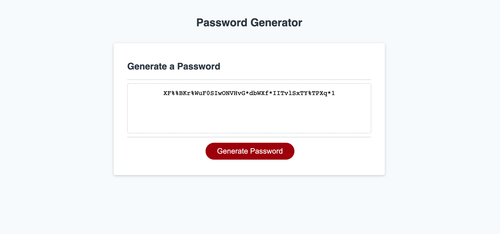

# Password-Generator

1. [ Description. ](#desc)
2. [ Web Address. ](#web-address)
3. [ Contributions. ](#contributions)
4. [ Licensing. ](#licensing)

## 1. Description

I have created a Password Generator to create a secure Password option for each user.
When you open the application, you are greeted with an alert tell you to press "generate password button" to begin. The the user is given the the option of iputing the amount of characters in their password. They must choose between 8-128. if a number outside of those paramaters, or a letter is chosen, they will be asked agian to enter an acceptable number for the application.
the application will then tell the user how many character they have chosen.
The user is then given 4 options for character they want the password to be made up with.
The options are Uppercase Letters, Lowercase Letters, numbers and Special Characters.
They musyt choose at least one of the 4 options to be able to generate the password. If user says no to all options they will be directed to choose at least one.
The application will then generate password and then display it in the text box.
User will be able to selct and copy password for their own use.

Application will deploy live with no errors and all files can be seen in my Github Repository.

## 2. How to Get There

### Click link to open in your browser.

[github pages site] https://jbarbss.github.io/Password-Generator/

[github repository site] https://github.com/Jbarbss/Password-Generator

### Deployed application screen shot

## 3. Contributions
Thank you to the following for their suggestions and insights.

Ben Durham (https://github.com/bdurham227)

Gabe Thomas (https://github.com/samohtebag)

Patrick Walker (https://github.com/pat31477)

Takuya Matsumoto (https://github.com/TakuyaMats)

## 4. Licensing

Copyright (c) 2021 Jason Barbanel

Permission is hereby granted, free of charge, to any person obtaining a copy of this software and associated documentation files (the "Software"), to deal in the Software without restriction, including without limitation the rights to use, copy, modify, merge, publish, distribute, sublicense, and/or sell copies of the Software, and to permit persons to whom the Software is furnished to do so, subject to the following conditions:

The above copyright notice and this permission notice shall be included in all copies or substantial portions of the Software.

THE SOFTWARE IS PROVIDED "AS IS", WITHOUT WARRANTY OF ANY KIND, EXPRESS OR IMPLIED, INCLUDING BUT NOT LIMITED TO THE WARRANTIES OF MERCHANTABILITY, FITNESS FOR A PARTICULAR PURPOSE AND NONINFRINGEMENT. IN NO EVENT SHALL THE AUTHORS OR COPYRIGHT HOLDERS BE LIABLE FOR ANY CLAIM, DAMAGES OR OTHER LIABILITY, WHETHER IN AN ACTION OF CONTRACT, TORT OR OTHERWISE, ARISING FROM, OUT OF OR IN CONNECTION WITH THE SOFTWARE OR THE USE OR OTHER DEALINGS IN THE SOFTWARE.